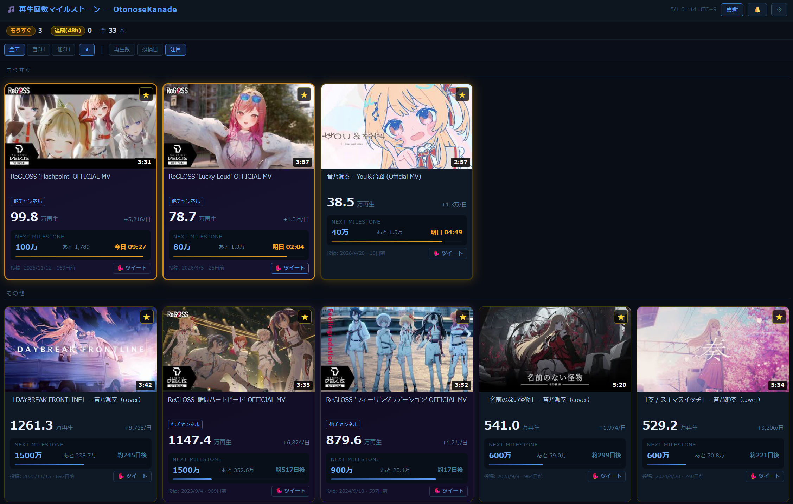

# 🎵 再生回数マイルストーン — OtonoseKanade

音乃瀬奏の動画再生数を追跡し、節目（100万・200万…）への到達予測をリアルタイム表示するツール。

---

## 使い方（一般）

**APIキー不要**で、そのままブラウザで開くだけで使えます。

**[ツールを開く →](https://f2sk.github.io/kanade-milestone/?mode=public)**

表示データは30分ごとに自動更新されます。

### 画面の見方

各カードには以下の情報が表示されます：

| 要素 | 説明 |
|------|------|
| サムネイル | クリックで YouTube 動画ページを開く |
| 再生時間 | サムネイル右下にオーバーレイ表示 |
| 再生数 | 現在の再生回数（切り捨て表示） |
| 勢い | 再生数の右側に「+XX万/日」形式で表示 |
| NEXT MILESTONE | 次の節目再生数・残り再生数・予測到達日・進捗バー |
| 投稿日 | 投稿年月日と経過日数 |
| 🐦 ツイートボタン | タイトル・URL・再生数情報を含むツイート画面へ遷移 |

### カードの色分け

| 色 | 意味 |
|----|------|
| 通常（ダークブルー） | 特に変化なし |
| オレンジ枠 | 近日中（3日以内）に節目到達予定 |
| ゴールド枠・発光背景 | 過去48時間以内に節目を達成 |
| 薄ゴールド枠 | 過去72時間以内に節目を達成（48h超） |
| バイオレット背景 | 手動追加した他チャンネルの動画 |

### フィルタ・ソート

フィルタは **チャンネル軸**（全て / 自CH / 他CH）と **マーク軸**（★）を独立して組み合わせられます。

| ソート | 動作 |
|--------|------|
| 再生数 | 再生数の多い順 |
| 投稿日 | 投稿日の新しい順 |
| 注目 | 達成済み・もうすぐ・その他 の3セクションに分けて表示 |

---

## パーソナライズ設定（上級）

ブラウザ通知・手動マーク・自動更新など個人の環境で使いたい場合は、YouTube Data API キーを登録して**個人モード**で使用できます。

**[個人モードで開く →](https://f2sk.github.io/kanade-milestone/)**

### 初回セットアップ

#### 1. YouTube Data API キーの取得

1. [Google Cloud Console](https://console.cloud.google.com/) にアクセス
2. プロジェクトを作成（または既存を使用）
3. 「APIとサービス」→「ライブラリ」→「YouTube Data API v3」を有効化
4. 「認証情報」→「認証情報を作成」→「API キー」
5. 取得したキーをコピー

> 無料枠（日次クォータ 10,000 単位）で十分です。

#### 2. ツールの初回起動

1. [ページを開く](https://f2sk.github.io/kanade-milestone/) と API キー入力画面が表示される
2. 取得したキーを入力して「保存して開始」をクリック
3. 自動的に動画データの取得が始まる

### 設定項目

| 項目 | 説明 | デフォルト |
|------|------|-----------|
| YouTube Data API Key | API キー（localStorage にのみ保存） | — |
| チャンネルハンドル | 対象チャンネルの @ 以降の文字列 | `OtonoseKanade` |
| 「もうすぐ」閾値（日） | 何日以内の予測到達をオレンジ表示するか | `3` |
| 自動更新間隔（分） | タブを開いている間の自動取得間隔 | `30` |

### 他チャンネル動画の追加

設定画面の「動画URLを追加」テキストエリアに YouTube の動画 URL を貼り付けて「追加して取得」をクリック。複数 URL をまとめてペーストできます。

### データ管理

| ボタン | 動作 |
|--------|------|
| JSON 出力 | 全データを JSON ファイルとしてダウンロード |
| JSON 取り込み | JSON ファイルを読み込んでデータを置き換え |
| データ削除 | 動画履歴・マーク・通知記録をリセット（API キーと設定は保持） |

### 個人モードでできること

- ★マーク：任意の動画にマークして★フィルタで絞り込み
- ブラウザ通知：節目達成時に通知（★マーク済み動画のみ）
- 他チャンネル動画の追加：コラボ・参加楽曲なども一緒に管理
- 自動更新間隔のカスタマイズ
- JSON によるデータ移行（端末間）

---

## よくある質問

**Q. 別のVTuberにも使えますか？**  
A. 個人モードで設定のチャンネルハンドルを変更することで対応可能です。データ削除してから切り替えることを推奨します。

**Q. API キーが漏れる心配はありますか？**  
A. キーはブラウザの localStorage にのみ保存され、外部サーバーには送信されません。YouTube API への直接リクエストにのみ使用されます。

**Q. 別端末でも同じデータを見たい**  
A. 設定画面の「JSON 出力」でデータを書き出し、別端末で「JSON 取り込み」することで移行できます。
